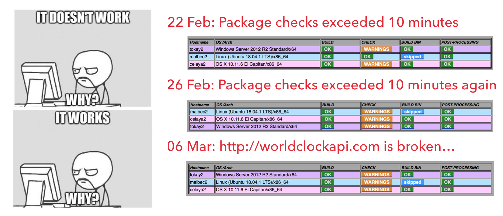
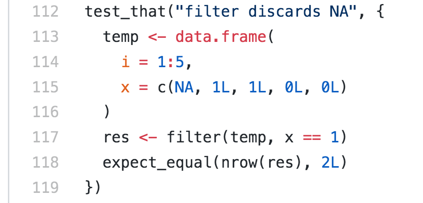
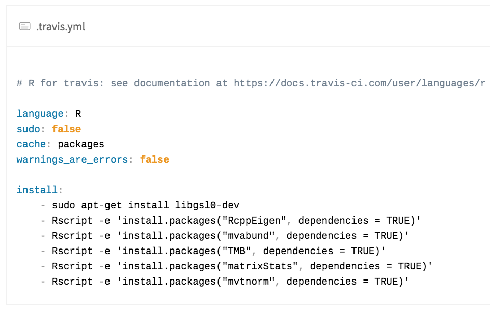

```{r, echo = FALSE, message=FALSE}
knitr::knit_hooks$set(error = function(x, options) {
  paste0("<pre style=\"color: red;\"><code>", x, "</code></pre>")
})
library(tidyverse)
```

class: segue

## Acknowledgement

Credits go to Garth, Dario and Mark for their advice. 

I do not believe in coding via talking, you have to struggle on your own to find a package building pipeline that suits your own style.

---

## Some resources

+ Read http://r-pkgs.had.co.nz/
+ StackExchange
+ `tidyverse` packages on GitHub
+ GitHub issues pages
+ Bioconductor style guide
+ ~~Garth~~ 

---

## Building a package is more than just coding

+ Writing functions takes 1 hour. Writing a package takes 1 day. Writing a well-designed package takes 1 month. 

+ Designs, organisations, dependencies, testing and debugging. 

+ Some packages that I worked on:
  
    - SmokyScotch: 55 commits
    - mcvis: 47 commits, 2 branches, 2 remotes
    - APES: 72 commits, 2 branches
    - scMerge: 152 commits, 4 branches, 2 remotes

+ Almost all of these packages broke in a major way a few times. That could be because of you or someone else entirely. 

---

## Packages of different standards

Loosely speaking, a `R` package is simply a folder with a bunch of scripts*.


  1. A `laptop` package
    - Write your code using `roxygen2`.
  1. A `GitHub` package
    - Make a GitHub repository and push.
  1. A CRAN package
    - `devtools::check()`
  1. A Bioconductor package
    - `BiocCheck::BiocCheck()`

  
.footnote[*This is great if you want to cheat-install a package that you are not meant to.]

---

## Manage your package files `devtools` and `roxygen2`

```{r}
.libPaths() %>% list.files() %>% head()
.libPaths() %>% paste0("/dplyr") %>% list.files()
```

+ `devtools` and `roxygen2` are packages that manage these files and folders for you.
    - `roxygen2`: managing the namespaces and documents
    - `devtools`: building, checking and installing the package
    
---

## Making a CRAN package

+ `devtools::build()` a package is cheap, `devtools::check()` a package is a much higher standard. 


.pull-left[
+ Everyone must pass this check before being put on CRAN

.content-box-red[Error: the worst of all.]

.content-box-yellow[Warning: less severe, but also prevents pass.] 

.content-box-green[Note: You should check these, but no worries]

]


.pull-right[

<center>

</center>

]


+ Hadley (and thus, I) recommends `devtools::check()` instead of `R CMD Check`.
---

class: segue

### Demo: `mcvis` - friday branch

---
## Making a Bioconductor package

+ Bioconductor has a greater focus on documentations, examples and vignettes, reproducibility and coding styles

+ Bioconductor uses GitHub + their own version of git + docker + virtual machine checker + human reviewer

+ Development must be done with respect to the **development branch** of Bioconductor AND the **unreleased development version** of `R`

+ Bioconductor has a much higher standard of accepting a package than CRAN

+ `BiocCheck::BiocCheck()` checks for

    * if maintainer is registered with BioC
    * coding documentations (e.g. `\dontrun{}` is forbidden)
    * coding style (e.g. recommended function length is less than 50 lines)
    

---

## Bioconductor build report: a virtual machine to check your package

<center>

</center>

---

class: segue

## Other useful tools

---

## `testthat`

+ A "test" folder is set up with a collection of test scripts. So that you can test if the outputs are genuinely matching with your pre-computed results.

<center>

</center>


---

## Travis: continuous integration

+ `.travis.yml` controls how a virtual machine should be set up to build and check your package.

+ Travis build is triggered by commits.

+ Configuring basic Travis is easy:

<center>

</center>


+ But configuring it for more complicate projects with multiple environment variables and flags is a bit harder: https://github.com/tidyverse/dplyr/blob/master/.travis.yml. 

---

## Should you use Travis?

My recommendation: use Travis to ensure robustness on other machines. But just be careful if you have a complex set-up, then be prepared to spend a lot of time on it.

+ Travis has some problems with support for R-devel and R for Windows.

+ `travis.org` is free for public GitHub repos. `travis.com` is free for private GitHub repos for first 50 triggers. 

+ Travis is community maintained, so there is no guarantee that it will always be up-to-date. 

+ E.g. BioC 3.9 was released on 26 April, but Travis seems to only updated the instructions at my request (https://github.com/travis-ci/travis-build/pull/1710) last week. 